# Dalili Dentiste Tounsi

Dalili Dentiste Tounsi est une plateforme open source qui combine web scraping, SQL, normalisation, dedoublonnage, OCR, geolocalisation, exports BI et assistant local pour construire une base exploitable de dentistes en Tunisie.

Le projet n'est pas un annuaire officiel et ne remplace pas une verification humaine. Il sert a montrer un pipeline complet de data engineering applique au domaine dentaire : collecter, nettoyer, verifier, consolider, rechercher et visualiser.

## Objectif

L'objectif est de transformer des profils publics disperses sur plusieurs sites en une base SQL plus propre et plus utile.

Le projet aide notamment :

- le grand public a trouver un dentiste par gouvernorat, localite, specialite ou telephone disponible ;
- les delegues medicaux et prospecteurs a travailler avec une base plus structuree ;
- les collecteurs de donnees a verifier les sources, les doublons, les localites et la qualite ;
- les developpeurs/data analysts a comprendre un pipeline complet de scraping vers dashboard.

## Ce que le projet demontre

- Scraping multi-source avec un script adapte a chaque site.
- Backend FastAPI connecte a une base SQLite.
- Normalisation des noms, telephones, gouvernorats, localites et adresses.
- Dedoublonnage inter-sources pour obtenir une base de dentistes uniques.
- Score de qualite pour filtrer les fiches exploitables.
- OCR de cartes de visite avec extraction de nom, specialite, telephone, adresse et code postal.
- Detection d'existence avant insertion depuis OCR ou formulaire.
- Assistant local minimal pour repondre a des questions standard sans API cloud obligatoire.
- Frontend Lovable/Vite connecte au backend.
- Exports CSV/XLSX et modele Power BI.
- Automatisation GitHub Actions pour tests, build et verification des sources.

## Stack technique

| Partie | Outils |
| --- | --- |
| Frontend | Lovable, Vite, React, TypeScript, TanStack Router, Tailwind CSS, Recharts |
| Backend | Python, FastAPI, SQLAlchemy, Pydantic |
| Base de donnees | SQLite |
| Scraping | HTTPX, BeautifulSoup, parsers dedies par source |
| Normalisation | Python, RapidFuzz, regles metier Tunisie |
| OCR | PaddleOCR, extraction FR / EN / arabe |
| Assistant | Assistant local determine par contexte + recherche dans la base SQL |
| Dashboard | Recharts, exports Power BI-ready |
| Automatisation | GitHub Actions |

## Interface creee avec Lovable

Le frontend du projet est base sur une interface generee et amelioree avec Lovable.

Lovable a ete utilise pour construire rapidement une experience moderne :

- page d'accueil publique ;
- espace de recherche ;
- cartes dentistes ;
- espace professionnel ;
- dashboard ;
- formulaire d'ajout de cabinet ;
- scan de carte de visite ;
- assistant flottant ;
- pages contact, mentions legales, confidentialite et signalement.

Le code Lovable se trouve dans :

```text
frontend/
```

Il a ensuite ete relie au backend FastAPI via les routes `/api/*`.

## Architecture

```text
Dalili Dentiste/
  backend/
    app/
      api.py                         API FastAPI
      database.py                    Connexion SQLite et tables principales
      models.py                      Modele normalise DentistRecord
      normalization/                 Nettoyage texte, telephone, localite
      services/
        pipeline.py                  Pipeline de collecte
        unique_dentists.py           Construction de la base unique
        relevant_database.py         Score qualite et base propre
        locality_geocoding.py        Normalisation/geocodage localites
        business_card_ocr.py         OCR cartes de visite
        activity.py                  Score heuristique de fiche fonctionnelle
      chatbot/
        local_llm.py                 Assistant local FR / tunisien / arabizi
    config/
      sources.yaml                   Sources configurees
      tunisia_localities_reference.json
    database/
      dentists_tunisia.db            Base SQLite locale
    scripts/
      source_runner.py               Lanceur de scraping
      build_relevant_database.py     Reconstruit les tables propres
      export_public_index.py         Export public sans telephone en clair
      export_powerbi_model.py        Exports Power BI
      check_sources_health.py        Verification des sources
  frontend/
    src/                             Interface Lovable/Vite
  .github/workflows/
    ci.yml                           Tests backend + build frontend
    weekly-update.yml                Rapport hebdomadaire des sources
  LANCER_DALILI.bat                  Lance backend + frontend en local
```

## Base de donnees

La base locale principale est :

```text
backend/database/dentists_tunisia.db
```

Tables importantes :

| Table | Role |
| --- | --- |
| `dentists` | Donnees brutes collectees depuis les sources. Une ligne correspond souvent a une fiche source. |
| `unique_dentists` | Base dedoublonnee. Plusieurs fiches sources peuvent etre fusionnees en un dentiste unique. |
| `relevant_dentists` | Fiches conservees apres score de qualite. |
| `dentists_clean` | Table finale utilisee par l'API, l'interface, les exports et le dashboard. |
| `locality_references` | Reference des localites tunisiennes pour normalisation et geocodage. |

La logique importante est la suivante :

1. `dentists` garde les donnees proches de la source pour audit.
2. `unique_dentists` fusionne les doublons probables.
3. `relevant_dentists` applique un score et rejette les fiches trop faibles.
4. `dentists_clean` sert de base stable pour le produit.

## Sources de donnees

Les sources sont declarees dans :

```text
backend/config/sources.yaml
```

Sources principales actuellement gerees par des scripts :

- `med.tn`
- `tunisie_medicale`
- `tunisie_dentiste`
- `lerdvmedical`
- `orthodontiste_tn`
- `para_doctor`
- `goafricaonline`

Sources configurees mais a revalider avant usage fiable :

- `sante_tunisie`
- `bonnes_adresses`

CNOMDT n'est pas scrape dans cette version. Il peut rester une source institutionnelle de verification si un scraper formulaire dedie est developpe dans le respect des conditions d'utilisation.

## Comment fonctionne le scraping

Chaque source a son propre script ou parser, car les sites n'ont pas la meme structure.

Le pipeline suit generalement ces etapes :

1. Detecter les pages de listing ou les endpoints publics.
2. Extraire les URLs de profils.
3. Visiter chaque profil.
4. Extraire nom, titre, specialites, telephone, adresse, gouvernorat, localite et URL source.
5. Normaliser les champs.
6. Inserer ou mettre a jour la base SQLite.
7. Reconstruire la base unique.
8. Reconstruire la base propre et les exports.

Commande type :

```powershell
cd "C:\Users\maiss\Desktop\Dalili Dentiste\backend"
python scripts\source_runner.py
python scripts\build_relevant_database.py --rebuild-unique
```

La collecte doit rester responsable : ne pas surcharger les sites, respecter leurs conditions, conserver la source, et ne pas presenter les donnees comme officielles sans verification.

## Dedoublonnage

Le dedoublonnage sert a eviter d'avoir le meme dentiste plusieurs fois quand il apparait sur plusieurs sources.

Les principaux signaux utilises sont :

- URL de profil identique ;
- nom/prenom normalises ;
- gouvernorat normalise ;
- telephone tunisien normalise ;
- adresse disponible quand elle renforce le matching ;
- groupes connectes quand plusieurs cles prouvent le meme profil.

Exemple :

```text
Med.tn:          Dr Chaima Bizani, Ariana, +216 93 777 169
Tunisie Medicale: Chaima BIZANI, Ariana, 93 777 169

=> Meme nom + meme gouvernorat + meme telephone
=> fusion dans unique_dentists
```

Le backend evite aussi les doublons lors d'un scan OCR ou d'un ajout manuel :

1. comparaison nom/prenom + localite/gouvernorat ;
2. comparaison telephone si disponible ;
3. si une fiche existe deja, l'API retourne `already_exists` au lieu d'inserer une copie.

## Score de qualite

Le score de qualite est calcule dans :

```text
backend/app/services/relevant_database.py
```

Une fiche gagne des points quand elle contient des informations utiles :

- profil reconnu comme dentiste ;
- gouvernorat present ;
- localite ou delegation presente ;
- telephone present et valide ;
- adresse presente ;
- specialite presente ;
- confirmation multi-source ;
- coordonnees valides.

Statuts :

| Score | Statut |
| --- | --- |
| 75 a 100 | `HIGH` |
| 50 a 74 | `MEDIUM` |
| moins de 50 | `REVIEW` ou rejet selon le cas |

Les fiches sont rejetees automatiquement si :

- la source est absente ou inactive ;
- le nom est absent ou trop court ;
- le profil ne semble pas etre un dentiste ;
- la source n'est pas consideree exploitable.

## Score "fonctionnel"

Le projet ne peut pas affirmer avec certitude qu'un cabinet est encore ouvert sans verification terrain ou source officielle recente.

Un score heuristique est donc calcule dans :

```text
backend/app/services/activity.py
```

Il estime si la fiche semble encore exploitable selon :

- presence sur plusieurs sources ;
- telephone public valide ;
- fixe ou mobile disponible ;
- adresse disponible ;
- gouvernorat et localite identifies ;
- URL source disponible.

Statuts possibles :

- `Fiche fiable`
- `Fiche correcte`
- `A completer`
- `A verifier`

Ce score est une aide a la priorisation, pas une preuve officielle d'activite.

## OCR des cartes de visite

Le module OCR se trouve dans :

```text
backend/app/services/business_card_ocr.py
```

Il sert a scanner une carte de visite et proposer une fiche dentiste.

Il tente d'extraire :

- nom du dentiste ;
- specialite ;
- telephone ;
- email ;
- adresse ;
- code postal ;
- localite ;
- gouvernorat.

Le moteur vise le francais, l'anglais, l'arabe et l'arabizi. Les cartes arabes sont traitees avec des mots-cles dentaires et des indices d'adresse.

Exemple important :

```text
2045 = code postal de L'Aouina / Tunis
Ce n'est pas Ariana automatiquement.
```

Apres extraction :

1. l'utilisateur verifie les champs ;
2. le backend verifie si le dentiste existe deja ;
3. si la fiche est nouvelle, elle est inseree dans SQL ;
4. les donnees OCR brutes sont conservees pour audit ;
5. la section est videe apres ajout reussi dans l'interface.

## Assistant local

Le chatbot est volontairement local et minimal. Il ne depend pas obligatoirement d'une API cloud.

Il repond a des questions simples en francais, tunisien et arabizi, par exemple :

- "nheb dentiste fi Ariana"
- "dentiste implantologie Sousse"
- "chkoun aandou telephone fi Tunis ?"
- "comment verifier les doublons ?"
- "quelle source contient le plus de fiches ?"

Il utilise le contexte disponible dans la base SQL et des reponses controlees. Il n'est pas un conseiller medical.

## API FastAPI

Backend local :

```text
http://127.0.0.1:8000
```

Endpoints principaux :

| Endpoint | Role |
| --- | --- |
| `GET /api/health` | Verifier que l'API repond. |
| `GET /api/dentists` | Rechercher dans `dentists_clean`. |
| `GET /api/dentists/filters` | Recuperer les filtres dynamiques. |
| `GET /api/dentists/{id}` | Detail d'une fiche. |
| `GET /api/overview` | Agregats du dashboard. |
| `GET /api/exports/source` | Export par source. |
| `GET /api/exports/dataset` | Exports complets, verifies, doublons, localites. |
| `POST /api/scan-card` | OCR d'une carte de visite. |
| `POST /api/cabinet-proposals/check` | Verifier si une fiche existe deja. |
| `POST /api/cabinet-proposals` | Ajouter une proposition dans SQL. |
| `POST /api/chat` | Interroger l'assistant local. |

## Frontend

Le frontend est l'interface creee avec Lovable/Vite.

URL locale :

```text
http://127.0.0.1:5173/
```

Espaces :

- espace public : recherche simple, profils, contact, assistant, scan carte ;
- espace professionnel : dashboard, dentistes, sources, qualite, doublons, localites, exports ;
- espace administration/pro : suivi des sources et indicateurs de qualite.

Les boutons Google Maps ouvrent une recherche ou une localisation dans un nouvel onglet quand l'adresse ou les coordonnees sont disponibles.

## Exports

Exports disponibles via API et scripts :

- annuaire complet ;
- fiches verifiees ;
- doublons detectes ;
- localites et gouvernorats ;
- export CRM ;
- export Power BI ;
- index public avec telephone non expose en clair.

Pour generer l'index public :

```powershell
cd "C:\Users\maiss\Desktop\Dalili Dentiste\backend"
python scripts\export_public_index.py
```

Les telephones ne doivent pas etre publies en clair dans les exports open source. Le projet fournit un index public avec `phone_hash`, `phone_encrypted` ou token non lisible selon la configuration locale.

## Power BI et dashboard

Le projet prepare des donnees exploitables pour Power BI :

```powershell
cd "C:\Users\maiss\Desktop\Dalili Dentiste\backend"
python scripts\export_powerbi_model.py
```

Le dashboard suit :

- nombre de dentistes uniques ;
- lignes sources avant dedoublonnage ;
- taux de fiches avec telephone ;
- couverture des gouvernorats ;
- specialites ;
- top gouvernorats ;
- repartition par source ;
- qualite des donnees ;
- localites prioritaires.

## Geolocalisation et localites

Le projet distingue autant que possible :

- gouvernorat ;
- delegation ;
- ville ;
- localite ;
- quartier ;
- code postal ;
- latitude/longitude ;
- precision de geocodage.

Niveaux de precision prevus :

- `exact`
- `street`
- `locality`
- `delegation`
- `governorate`
- `unresolved`

Regles importantes :

- ne pas transformer automatiquement un cas ambigu ;
- conserver la valeur originale de la source ;
- detecter les coordonnees invalides comme `0,0` ;
- rejeter les coordonnees hors Tunisie ;
- eviter de presenter le centre du gouvernorat comme adresse exacte.

## Automatisation GitHub Actions

Le dossier :

```text
.github/workflows/
```

contient deux workflows.

### CI

Fichier :

```text
.github/workflows/ci.yml
```

Declenchement :

- a chaque `push` sur `main` ;
- a chaque pull request ;
- manuellement avec `workflow_dispatch`.

Ce workflow :

1. installe Python ;
2. installe le backend ;
3. lance les tests Pytest ;
4. verifie la configuration des sources ;
5. installe Node ;
6. construit le frontend.

### Maintenance hebdomadaire

Fichier :

```text
.github/workflows/weekly-update.yml
```

Declenchement :

- chaque lundi a 02:00 UTC ;
- manuellement depuis GitHub Actions.

Ce workflow produit un rapport de sante des sources :

```text
backend/reports/source_health_latest.json
```

Il peut verifier seulement la configuration ou tester les URLs en live selon l'option choisie.

Il ne doit pas publier automatiquement une nouvelle base sans validation humaine. Le scraping complet est volontairement separe de la CI pour eviter les surcharges de sites et les changements non verifies.

## Lancer le projet en local

Option rapide :

```powershell
cd "C:\Users\maiss\Desktop\Dalili Dentiste"
.\LANCER_DALILI.bat
```

Puis ouvrir :

```text
Frontend : http://127.0.0.1:5173/
Backend  : http://127.0.0.1:8000/api/health
```

Important :

- `http://127.0.0.1:5173/` est l'interface de l'application.
- `http://127.0.0.1:8000/` est le serveur API ; la racine peut afficher `Not Found`, c'est normal.
- Pour tester le backend, ouvrir plutot `http://127.0.0.1:8000/api/health`.
- Le fichier `LANCER_DALILI.bat` lance les deux serveurs et ouvre automatiquement le frontend.

## Demo video automatique

Le projet contient un script Playwright pour manipuler l'interface automatiquement et produire des captures + une video de demo.

Fichier :

```text
demo/record-demo.mjs
```

Guide :

```text
demo/README.md
```

Lancer l'application :

```powershell
cd "C:\Users\maiss\Desktop\Dalili Dentiste"
.\LANCER_DALILI.bat
```

Puis lancer la demo :

```powershell
cd "C:\Users\maiss\Desktop\Dalili Dentiste\frontend"
node ..\demo\record-demo.mjs
```

La demo couvre :

- page d'accueil ;
- recherche publique ;
- ouverture d'un profil ;
- assistant Dalili ;
- espace professionnel ;
- scan OCR d'une carte de visite ;
- dashboard professionnel.

Les sorties sont creees dans :

```text
demo/output/screenshots/
demo/output/videos/
```

## Captures d'ecran pour GitHub

Les captures stables de presentation sont disponibles dans :

```text
docs/screenshots/demo-sequence/
```

| 1. Accueil | 2. Espace public |
| --- | --- |
| 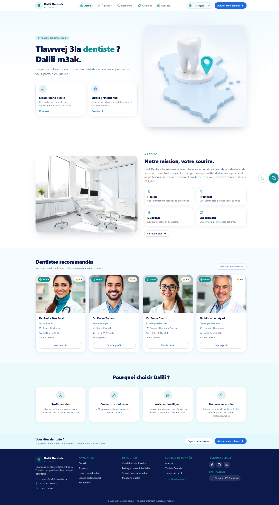 | 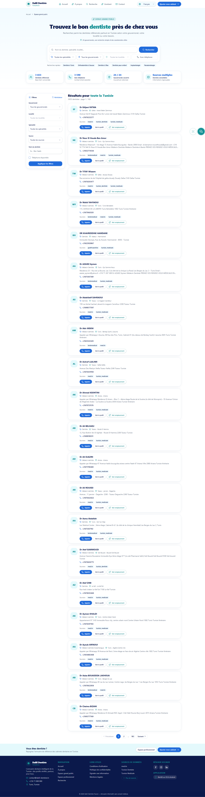 |

| 3. Fiche dentiste + chatbot | 4. Espace pro - vue d'ensemble |
| --- | --- |
| 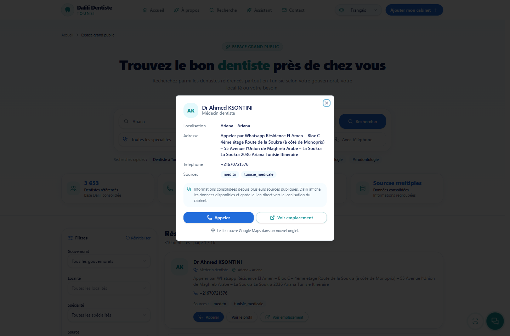 | 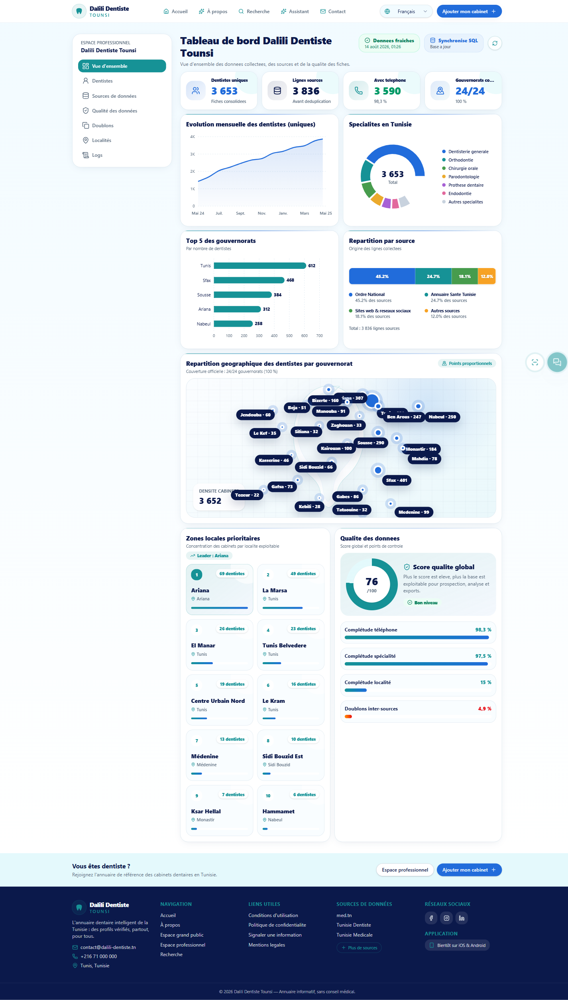 |

| 5. Dentistes | 6. Sources |
| --- | --- |
| 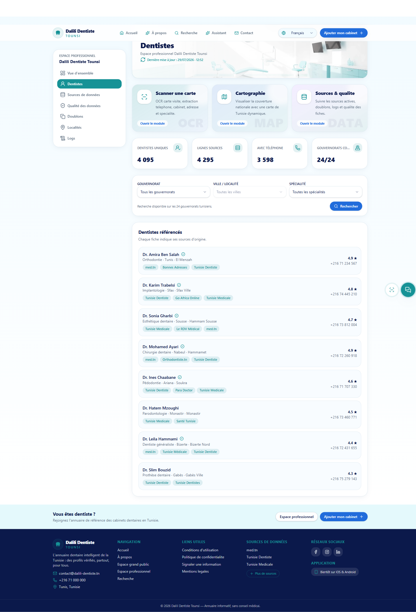 | 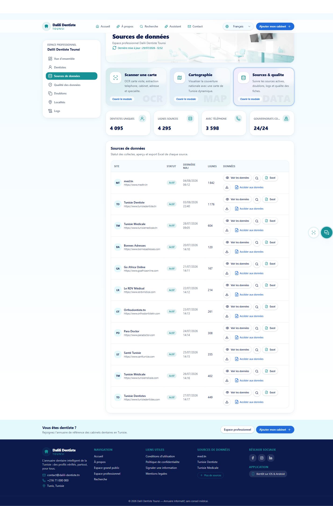 |

| 7. Qualite | 8. Doublons |
| --- | --- |
| 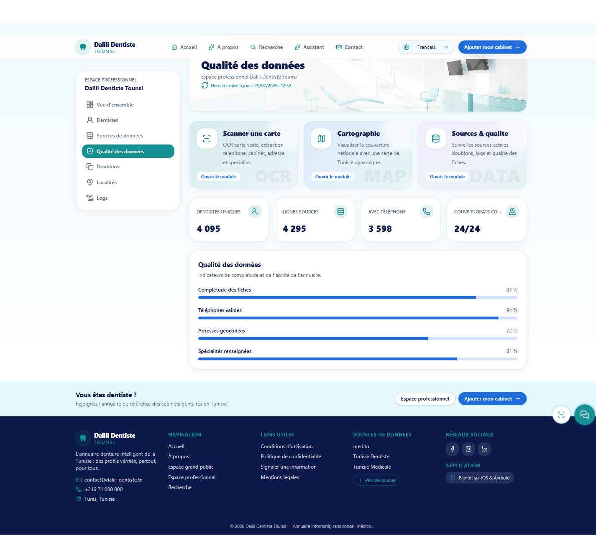 | 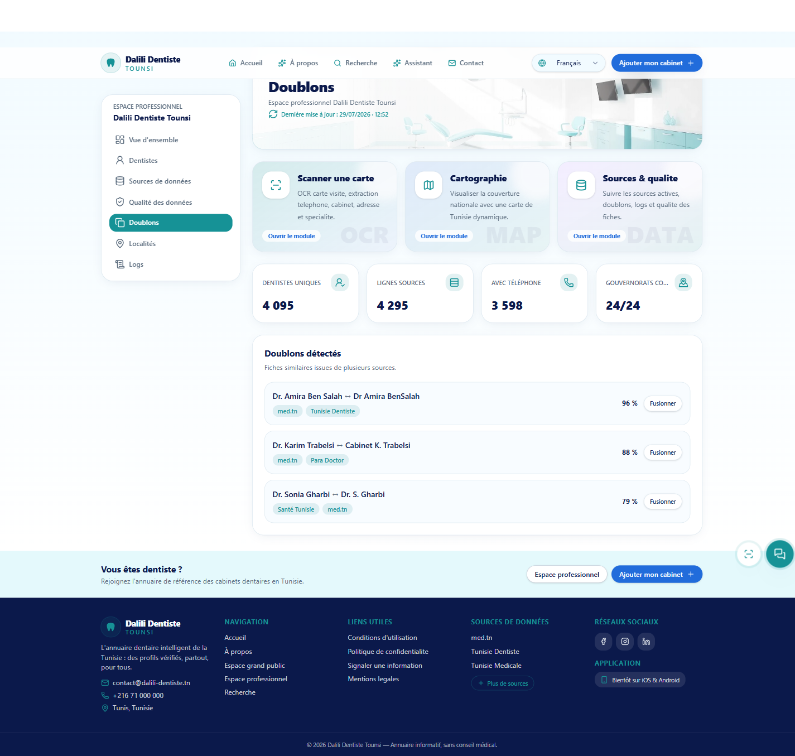 |

| 9. Localites | 10. Logs |
| --- | --- |
| 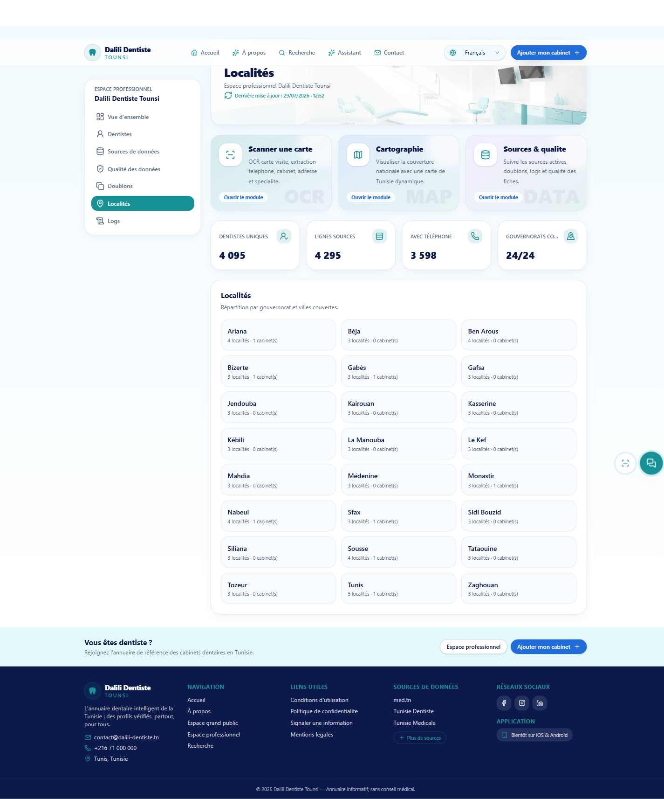 | 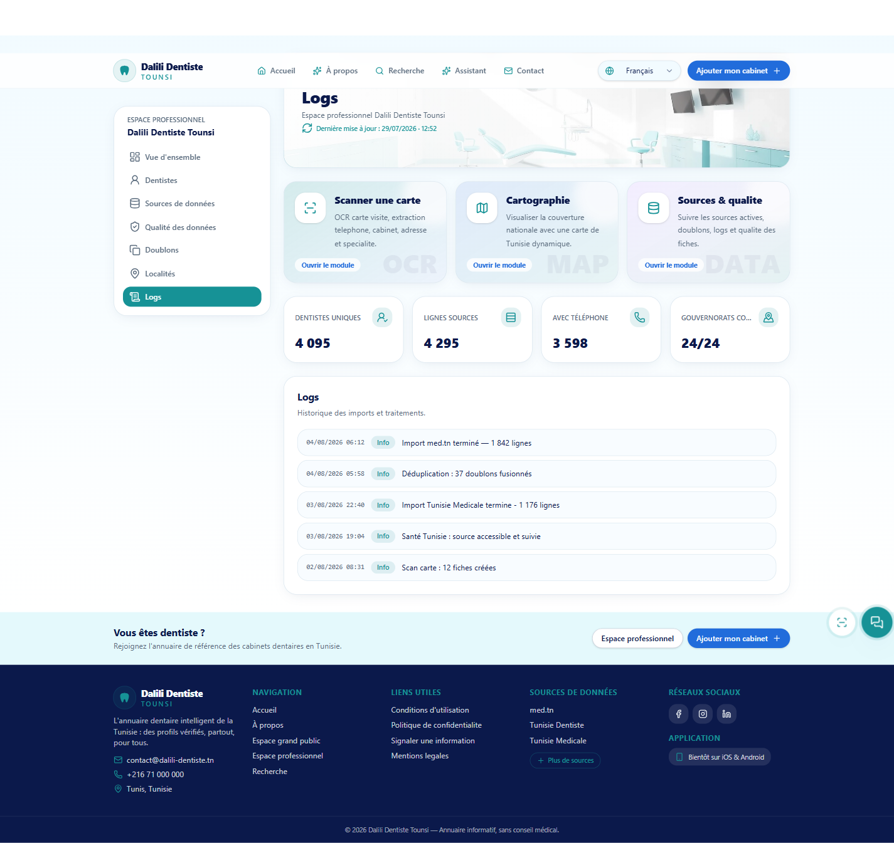 |

| 11. Scan carte |
| --- |
| 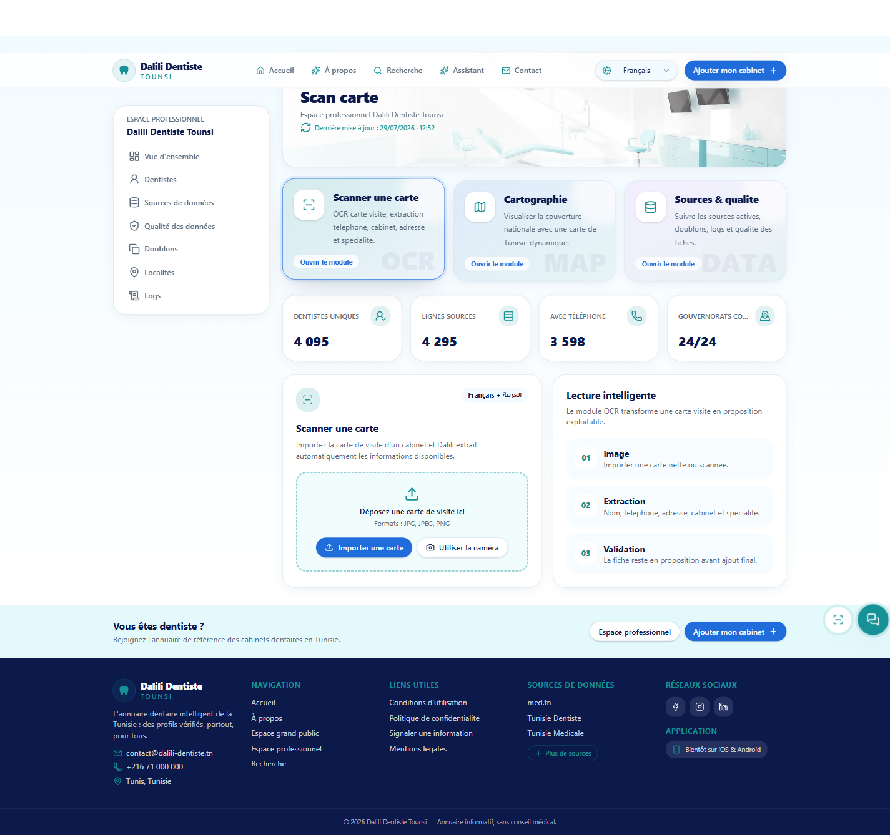 |

| 12. Formulaire d'ajout | 13. Contact et avis |
| --- | --- |
| 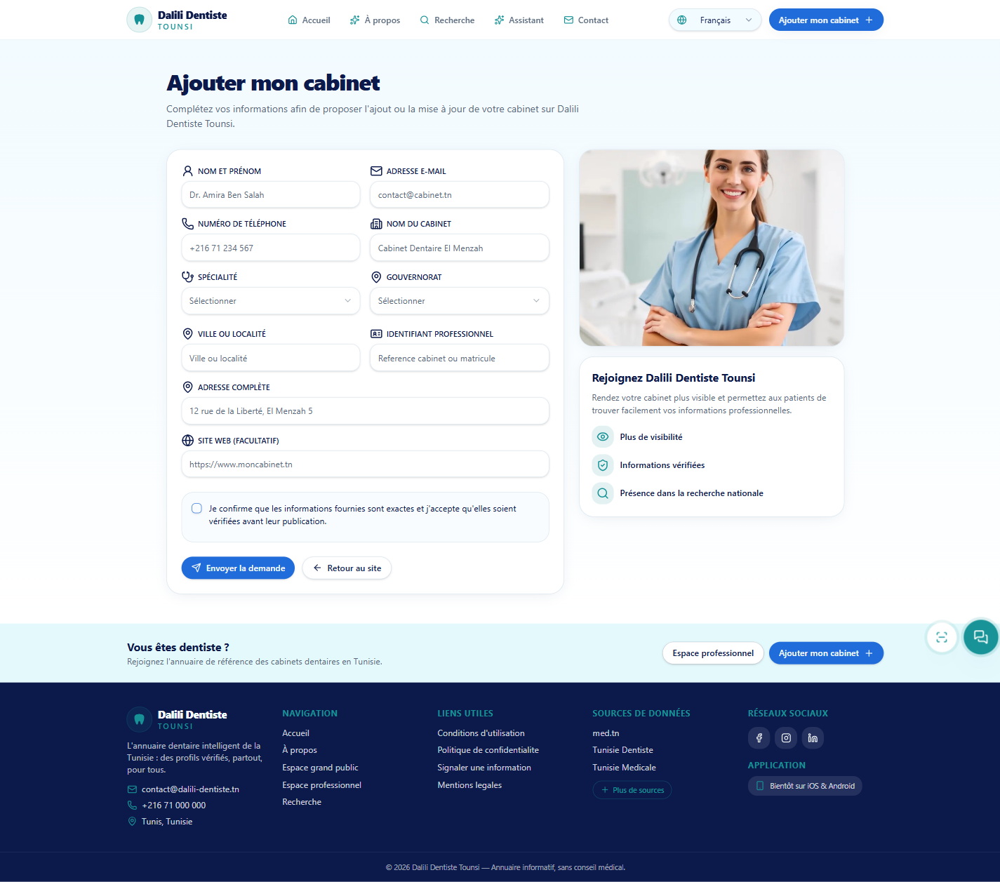 | 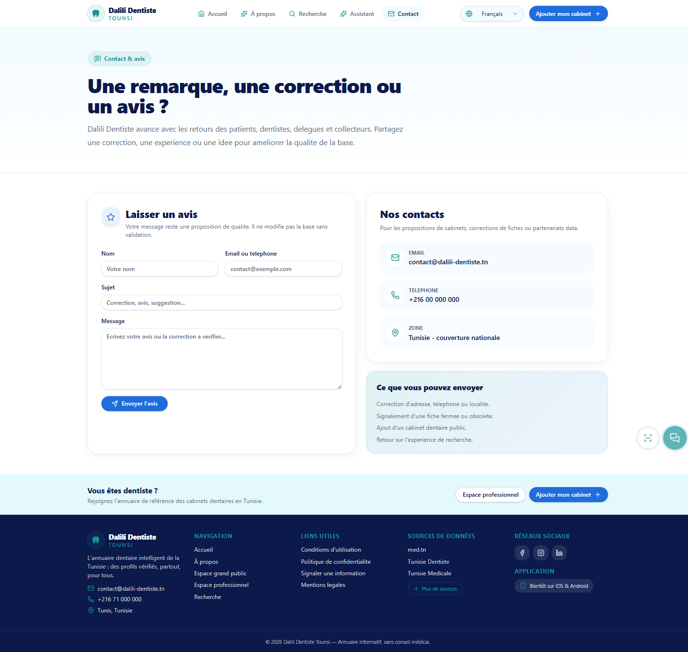 |

Backend seul :

```powershell
cd "C:\Users\maiss\Desktop\Dalili Dentiste\backend"
python -m uvicorn app.api:app --host 127.0.0.1 --port 8000
```

Frontend seul :

```powershell
cd "C:\Users\maiss\Desktop\Dalili Dentiste\frontend"
npm install
npm run dev -- --host 127.0.0.1 --port 5173
```

## Tester

Backend :

```powershell
cd "C:\Users\maiss\Desktop\Dalili Dentiste\backend"
python -m pytest
```

Frontend :

```powershell
cd "C:\Users\maiss\Desktop\Dalili Dentiste\frontend"
npm run build
```

Verification des sources :

```powershell
cd "C:\Users\maiss\Desktop\Dalili Dentiste\backend"
python scripts\check_sources_health.py
```

## Ouvrir SQLite

Avec SQLite CLI :

```powershell
cd "C:\Users\maiss\Desktop\Dalili Dentiste\backend"
sqlite3 database\dentists_tunisia.db
```

Exemples SQL :

```sql
.tables
SELECT COUNT(*) FROM dentists_clean;
SELECT governorate, COUNT(*) AS total
FROM dentists_clean
GROUP BY governorate
ORDER BY total DESC;

SELECT full_name, title, governorate, locality, phone
FROM dentists_clean
WHERE governorate = 'Ariana'
LIMIT 20;
```

Avec DB Browser for SQLite :

1. ouvrir `backend/database/dentists_tunisia.db` ;
2. onglet `Browse Data` pour voir les tables ;
3. onglet `Execute SQL` pour interroger.

## Confidentialite et publication open source

Le projet vise a etre utile, mais les donnees de contact doivent etre publiees avec prudence.

Recommandation :

- publier le code ;
- publier les schemas ;
- publier un extrait demo ;
- publier un index public sans telephone en clair ;
- garder la base brute complete en local ou dans un stockage prive ;
- documenter la source de chaque ligne ;
- laisser un mecanisme de correction ou retrait.

## Limites actuelles

- Les donnees ne sont pas officielles.
- Certaines sources peuvent changer leur HTML.
- La detection "cabinet encore fonctionnel" reste heuristique.
- La geolocalisation exacte n'est fiable que si l'adresse ou les coordonnees sont suffisamment precises.
- Les localites tunisiennes doivent continuer a etre enrichies.
- L'OCR peut se tromper sur les cartes floues ou manuscrites.

## Roadmap

- Stabiliser uniquement les sources vraiment actives.
- Enrichir la reference des codes postaux tunisiens.
- Ajouter une validation humaine plus complete des localites ambigues.
- Ajouter plus de tests OCR arabe/francais.
- Ajouter des screenshots propres pour GitHub.
- Ameliorer le chatbot local avec un petit modele local ou un moteur RAG local.
- Preparer un guide Power BI complet.
- Ajouter une page de documentation pour les collecteurs et delegues.

## Description GitHub recommandee

```text
Plateforme open source de collecte, normalisation, dedoublonnage, OCR et recherche intelligente pour constituer une base exploitable de dentistes en Tunisie.
```

## Angle LinkedIn recommande

Dalili Dentiste Tounsi montre comment passer d'un web scraping multi-source a une application data complete : base SQL, nettoyage, dedoublonnage, OCR de cartes de visite, assistant local, dashboard professionnel et exports BI.

Le projet est pense comme un portfolio concret en Python, FastAPI, SQLite, OCR, data quality et frontend moderne.

## Licence et responsabilite

Ce projet est fourni a des fins techniques, educatives et d'analyse de donnees. Il ne fournit pas de conseil medical. Les informations collectees doivent etre verifiees avant usage professionnel, commercial ou public.
